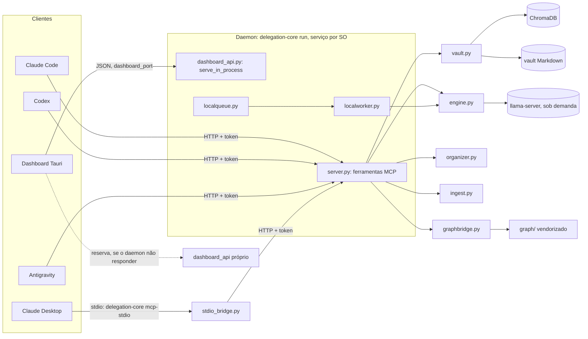

# Mapa do delegation-core

Estrutura do sistema: o que cada parte faz, como as partes se ligam e que
regras os testes defendem. **Este arquivo não carrega números** (linhas,
testes, ferramentas, linhas do índice): número que muda sozinho envelhece na
prosa sem que nada falhe. Para números, rode os comandos da última seção ou
pergunte ao servidor: `capabilities()` e `heartbeat()`.

## O que é

Um servidor MCP local sobre um vault de Markdown, com índice vetorial
(ChromaDB + BGE-m3), um modelo local opcional (llama.cpp, ou um servidor
compatível como o `mlx_lm.server`), um pipeline de grafo de código vendorizado
do Graphify, uma CLI completa e um dashboard Tauri.

## Topologia em execução



Uma instalação roda **um** daemon (`delegation-core run`), registrado como
serviço de usuário (systemd, launchd ou tarefa/atalho no Windows). Ele serve o
MCP em `server_port` e a API do dashboard em `dashboard_port`, no mesmo
processo. A CLI que escreve no índice entrega o trabalho ao daemon
(`daemon.py`) em vez de abrir um segundo escritor.

## O núcleo, por responsabilidade

**Entrada e transporte**
- `server.py`: as ferramentas MCP e `run_server()`.
- `cli.py`: a linha de comando.
- `daemon.py`: a metade cliente do HTTP, usada pela CLI.
- `auth.py`: token bearer obrigatório no loopback.
- `client_tracking.py`: quem está conectado, por sessão MCP.
- `stdio_bridge.py`: ponte stdio para o Claude Desktop.
- `capabilities.py`: o relatório gerado do que o servidor faz.
- `dashboard_api.py`: a API JSON do dashboard.

**Vault, índice e notas**
- `vault.py`: o `VaultManager`. Abre o ChromaDB, indexa, busca, reindexa e mede
  a saúde do vault.
- `notes.py`: nomes, caminhos e frontmatter. Só biblioteca padrão; é a camada
  mais baixa e não importa nenhum módulo do pacote além de `locking`.
- `notewriter.py`: o caminho único de escrita de nota.
- `embeddings.py`: fábrica do BGE e fatiamento de texto.
- `linker.py`: wikilinks e relink aditivo.
- `index_lock.py` e `locking.py`: trava de reabertura do índice e trava entre
  processos.
- `recuperacao.py`: índice que derruba quem o abre vai para quarentena e é
  reconstruído das fontes.
- `repair.py`: acha e conserta nota sintetizada a partir de nada.

**Manutenção do inbox**
- `organizer.py` orquestra: `extractor.py` (formatos para texto, incluindo
  imagem por EXIF e OCR via `imagens/`), `classifier.py`, `splitter.py`,
  `synthesizer.py`, `merger.py`, `sidecar.py` e `junk.py`.

**Geração local**
- `engine.py`: o `DelegationEngine`, que sobe o motor e roteia entre local,
  agente e híbrido.
- `localqueue.py` e `localworker.py`: a fila de tarefas para o modelo local,
  com um consumidor.
- `gpu.py`: exclusão mútua entre BGE e modelo local na mesma placa. Só entra em
  jogo para quem está na GPU: `embed_device` e `llama_device` dizem onde cada
  um roda, e o `doctor` avisa quando os dois vão disputar a placa.
- `jobs.py`: jobs em segundo plano com tempo típico pelo histórico.
- `tracker.py`: processos persistentes entre sessões.

**Ingestão externa e grafos**
- `ingest.py`: indexa pastas de fora do vault sem mover nada, com registro.
- `graphbridge.py`: orquestra o pipeline de grafo e escreve os artigos no vault.
- `graph_hook.py` e `graph_hook_rebuild.py`: hook de git que refaz o grafo.
- `graph/`: Graphify vendorizado. Mudá-lo custa o re-vendor.

**Instalação e operação**
- `installer.py`, `wizard.py`, `service.py`, `clients.py`, `windows.py`,
  `doctor.py`, `downloader.py` e `config.py`.

**Hooks de sessão do Claude Code** (`hooks/`, dentro do pacote)
- `entrada.py`: o comando `delegation-core-hook`, um processo por evento. O
  instalador o registra no `~/.claude/settings.json`.
- `session_start_brief.py`: resumo do que mudou no vault, no início da sessão.
- `session_export.py` e `llama_session_stop.py`: no fim da sessão, em sequência,
  a transcrição com segredos redigidos e a parada do modelo local ocioso.

**Fora do pacote**
- `dashboard/`: a casca Tauri e a interface.
- `skills/`: skills da Anthropic distribuídas junto.

## Camadas

Nenhum módulo do núcleo depende, nem por import dentro de função, de um módulo
que dependa dele. `tests/test_sem_ciclos_de_import.py` falha se um ciclo
voltar. Na prática:

- `notes` é a base: só importa `locking`. `config` só importa `embeddings`,
  e dentro de função.
- `vault` fica acima de `notes`, `embeddings`, `linker` e `recuperacao`; quem
  precisa do registro de ingestão (`ingest`) é o `vault`, não o `notes`.
- `doctor` olha para os outros módulos; só a `cli` e a `recuperacao` (que usa
  a sonda do índice) olham para ele.
- `cli` e `server` são as duas superfícies no topo.

## Invariantes que o código defende com teste

- Nenhum teste escreve em `~/.delegation_core` (`tests/conftest.py`, autouse).
  Existe porque um teste sobrescreveu o `config.json` real e derrubou o daemon.
- Nenhum ciclo de import no núcleo (`test_sem_ciclos_de_import.py`).
- Análise estática limpa no núcleo, hooks incluídos, com pyflakes e erro de sintaxe
  (`test_analise_estatica.py`). Pegaria o `{_lang}` que deixou o `compress`
  local quebrado por um mês.
- Nenhuma função interna (nome com `_`) publicada como ferramenta MCP
  (`test_ferramentas_publicas.py`).
- `__version__` e `pyproject.toml` concordam, e não há terceira cópia.
- A prosa não carrega contagem de testes; a contagem de ferramentas MCP, onde
  aparece, é conferida contra `server.py`, inclusive nesta pasta `docs/`.
- `notes.py` não pode voltar a importar `chromadb`, `embeddings`, `gpu` nem
  `vault`, e o `vault.py` tem teto de tamanho.
- Nenhum módulo fora do `engine` abre `/v1/chat/completions`
  (`test_motor_unico.py`).
- Toda nota arquivada por `graph_build` é carimbada em `.chroma_index.json`.

## Como medir

```bash
cd ~/Projects/delegation-core

# Testes (pip install -e .[dev] traz o ruff da análise estática)
python -m pytest -q

# Ferramentas MCP publicadas
python -c "import asyncio, delegation_core.server as s; print(len(asyncio.run(s.mcp.list_tools())))"

# Tamanho do núcleo
wc -l src/delegation_core/*.py

# Grafo de código: graph_build_bg pelo MCP, depois graph_report e graph_affected
# Saúde do servidor e do vault: capabilities(), heartbeat(force=true) e
# vault_health_detail() pelo MCP; delegation-core doctor pela linha de comando
```
